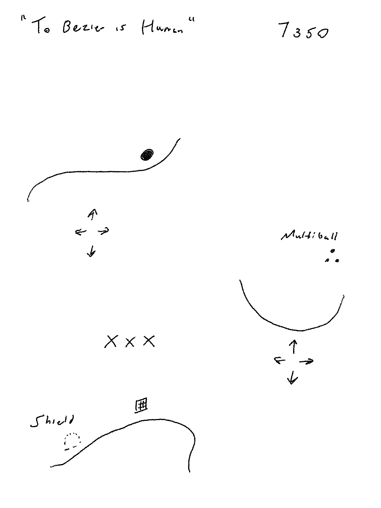

# Recurse Center Blagg -- Jan 19, Day 12

The blogs are coming fewer and farther between!

OK, not quite, I just had a bunch of social commitments lined up for last Friday and didn't feel like summarizing the week, and I'm working on taking the advice to make time for social commitments at RC. I think I might be working a *little* more solo than average here as I rotate through all of the different frameworks and projects I want to touch but I'm not out of momentum yet... I should probably get more involved in organizing group stuff? Oh well, note to self.

I *finally* wound up shipping something on mobile with react-native toward the end of the week -- a port of Roast Beef Kazenzakis's [Eggs and Milk Minder](https://github.com/axfelix/eggsandmilk). It strikes me that I'm not even sure if this is still a common intro computer science assignment, and I don't know how popular Achewood is with the kids these days... so it might look as though I've actually just done something very, very trivial. Oh well! It was fun and made me smile. More importantly, it helped me finally internalize the way that react-native works -- no DOM manipulation! Lots of `useState('')` declarations! Toggles for styles instead of setting them on the fly! OK, it wasn't that bad, but still, it took me a minute. I owe a lot of "this feels like the right way to work" mental energy to [Expo](https://docs.expo.io/) as well, which helps automate building and testing. As I think I've said before, while I really like being *able* to do native app development, I've never really enjoyed the overhead of working with big platform-specific IDEs, so I'm always looking for the good cross-platform, CLI thing, and I found it! I don't think I'm going to bother pushing this app to the App Store, but I have it running on my phone, and that's swell.

This is GAME JAM week so I am GAME JAMMIN'. I wrote some Lua once ages ago and don't have much interest in trying to make some huge 3D space full of stock assets look like it's doing something intentional, so it made perfect sense to finally try my hand at [Pico-8](https://www.lexaloffle.com/pico-8.php), which I've admired for years and have had a copy of since the itch.io Racial Justice bundle from several months back. I mocked up a game design the other night on my Remarkable after stumbling on [this bezier curve demo](https://www.lexaloffle.com/bbs/?pid=62928#p), which looked like this:

And, as of yesterday, I now have it doing this:

This was actually a decent achievement for a day's work, at the far end of where I was hoping to get to! After figuring out how the Pico-8 filesystem, sprite editing, syntax, etc. was supposed to work (all very intuitive but still a nice amount of brain-lifting for a Monday), the trickiest part by far was figuring out how to properly initialize multiple instances of a class (the curves) when Lua doesn't *quite* support normal OOP; [this documentation](https://www.lexaloffle.com/bbs/?tid=38095) helped, as did a very kind user from the Pico-8 discord called merwok. I think adding features from here should actually be pretty straightforward, knock on wood; I need to add an actual ball sprite today to roll off of the curves, so I'll need collision detection, and from there it should just be a lot of fine-tuning.

To be honest, I'm not sure that I'm learning a ton about programming from working on this game -- just hacking around here and there without a great deal more sophistication than when I first played with making a game in QB about 20 years ago -- but I've always wanted to be able to GAME JAM on a deadline, and so, like I keep coming back to, it's all about being able to execute. Intellectually speaking, though, it was pretty interesting to figure out how to make it satisfying (but still somewhat awkward) to control a cubic bezier curve that has four points with just two axes... nice little design problem there.