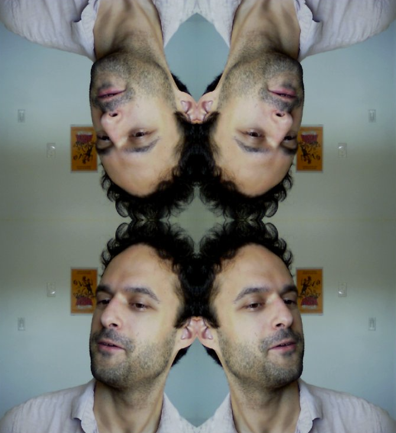

# Recurse Center Blagg -- Jan 25, Day 16

There was an old Japanese golf video game -- I think it must have been one of the Hot Shots or Everybody's Golf releases because the only alternative is Mario Golf and it doesn't sound like Mario Golf in my head -- that would make a big show out of being halfway through the golf course. A jingle would play and it would say *AT THE TURN* in big letters on the screen.

Anyway, I'm halfway through my time at Recurse!

It feels like a lot of progress so far, though I think that's because I've been very careful *not* to commit too far to anything, and I should probably get over that -- there's one extra secret big project I've been putting off and putting off in the hopes of being able to go broader, but I might have to finally dust it off next week (especially since the only further alternative I've come up with is learning Haskell, which sounds like a gag, though I have always admired [pandoc](https://pandoc.org/) and many of the engineers I know love to talk about functional programming, so I might as well learn what that actually is).

But anyway! I'm getting ahead of myself. 

I wound up calling my Pico-8 game finished on Wednesday; after I got the basic controls and the game concept mapped out and working on paper, I realized how tedious it was going to be to implement proper collision detection and physics in Pico-8; I couldn't see myself learning much more about programming from trying to get the ball bouncing in a way that actually felt playable, so I wound up [uploading it](https://www.lexaloffle.com/bbs/?tid=41217) to the Pico-8 repository and calling it done. I liked getting to work out the curve manipulation controls and Lua's version of lookup tables and said as much on the landing page; if anyone else ever wants to work on it on that basis; great!

I unexpectedly paired with two people on Thursday to look over their Python code -- I got to help Kelly with an issue around SQLAlchemy namespaces and imports, and I got to look at pdb debugging with Azhad. This was a lot of fun, especially as I haven't been aggressively seeking out opportunities to pair, and in both cases I got to share some pretty simple and effective Python experience, along with an extra set of eyes; I continue to very successfully avoid complexity 😊

I also spent some time playing with WebGL, since I've been touching a lot of web canvas elements in the past month over my various experiments, and I wanted to see what shader programming looked like in this context. GLSL is pretty neat and comprehensible, it turns out; there are a lot of really usable examples of simple vertex+fragment shader transforms (mostly using p5.js, which is a semi-port of Processing) for your webcam out there, e.g. [here](https://itp-xstory.github.io/p5js-shaders/#/./docs/examples/image_effects) and [here](https://github.com/aferriss/p5jsShaderExamples), and that led me to make a hair mandala:

And then [this](https://twitter.com/axfelix/status/1352352262908047361/video/1), which is about where I stopped.

Finally, on Friday, I gave the ffmpeg talk that I had kicking around my brain for the past few weeks. I really love working with ffmpeg and while it's arguably a way to *avoid* programming as much as it is a way to program, it's so fundamental to a lot of audiovisual pipelines these days that I think it should be in everyone's toolkit.

I promised to share all the links from that talk here, so here they are!

- [ffmpeg homepage](https://ffmpeg.org/documentation.html)
- [Projects using ffmpeg](https://trac.ffmpeg.org/wiki/Projects) -- as I mentioned, this is one of those "why is my car reading me the GPL" situations; it's everywhere
- [giphy blogpost on making gifs with ffmpeg](https://engineering.giphy.com/how-to-make-gifs-with-ffmpeg/) -- pretty educational and useful, I've also had good luck with [Gifski](https://gif.ski/)
- [ffmprovisr](https://amiaopensource.github.io/ffmprovisr/) -- ffmpeg recipes maintained by AMIA Open Source
- [ffprobe, one of the key other binaries ffmpeg provides](https://ffmpeg.org/ffprobe.html)
- [Using ffmpeg for hardware encoding](https://superuser.com/questions/1296374/best-settings-for-ffmpeg-with-nvenc)
- [ffmpeg art school -- video transforms](https://amiaopensource.github.io/ffmpeg-artschool/scripts.html)
- ffmpeg [Python](https://github.com/kkroening/ffmpeg-python), [js](https://github.com/fluent-ffmpeg/node-fluent-ffmpeg), and [C](https://dev.to/ac000/using-the-ffmpeg-libs-c-api-to-transcode-audio-fe9) bindings.
- [LosslessCut](https://mifi.no/losslesscut/) -- a thin electron GUI on ffmpeg for doing video trims without having to reencode.

I also wound up using [webssh](https://pypi.org/project/webssh/) to display my terminal in the browser for that talk, for anyone curious -- I used to have a solution for this, and I wound up having to research a new one on Friday morning to find something totally cross-platform that I was happy with again. It even works on Windows, assuming you're running an ssh server on your Windows machine that can provide an msys bash shell (which I, and maybe five other people in the world, already was -- [Bitvise](https://www.bitvise.com/)).
